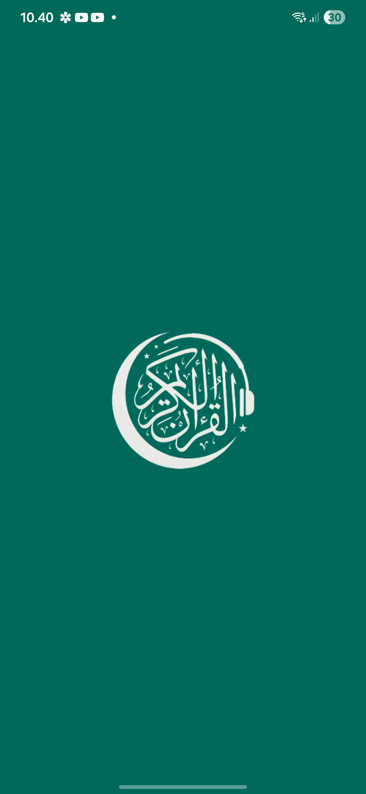
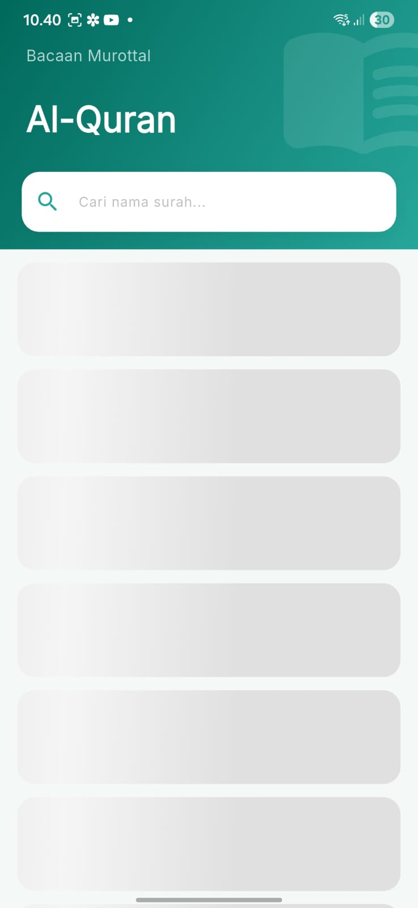
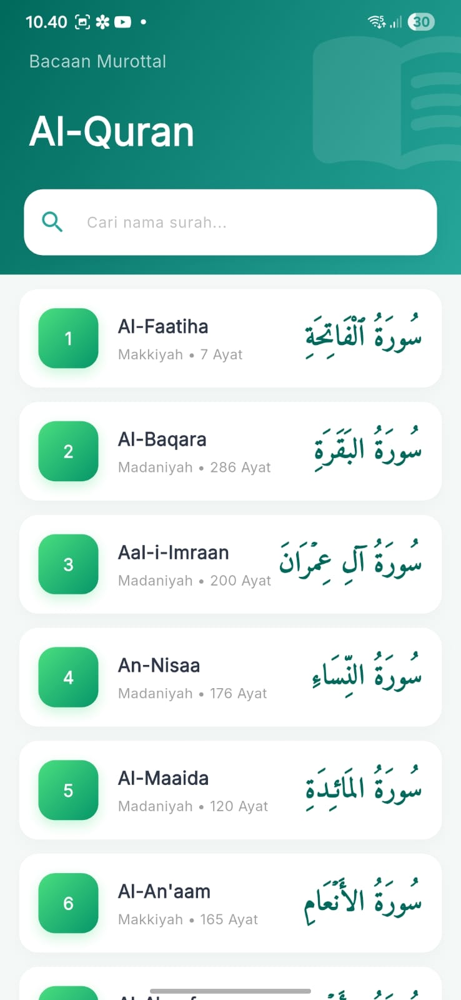
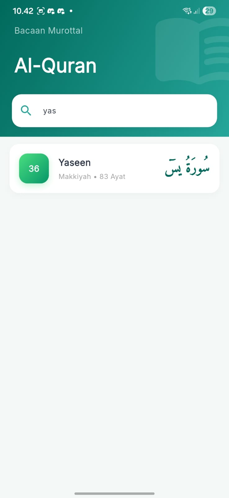
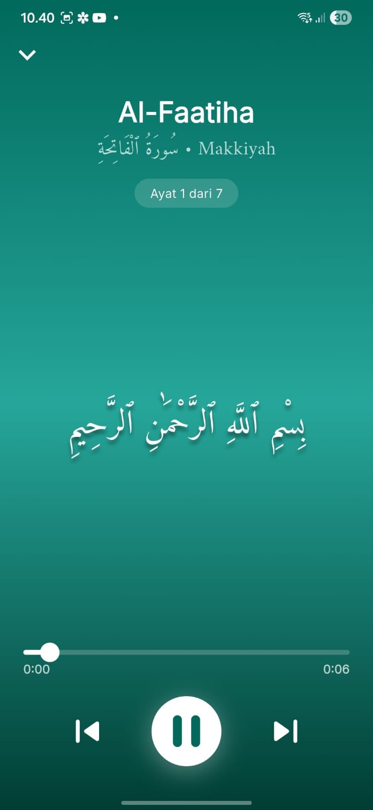
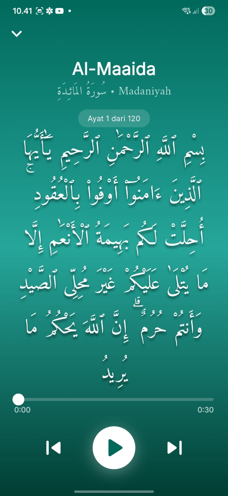
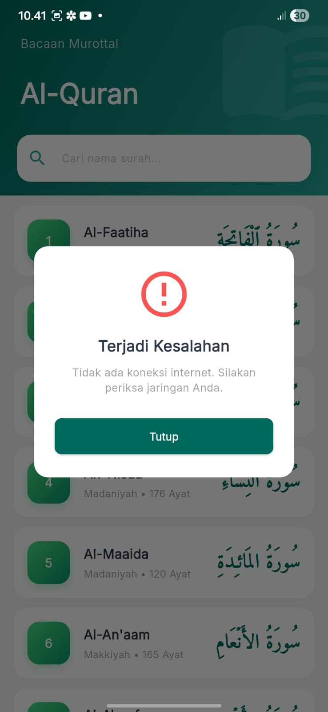
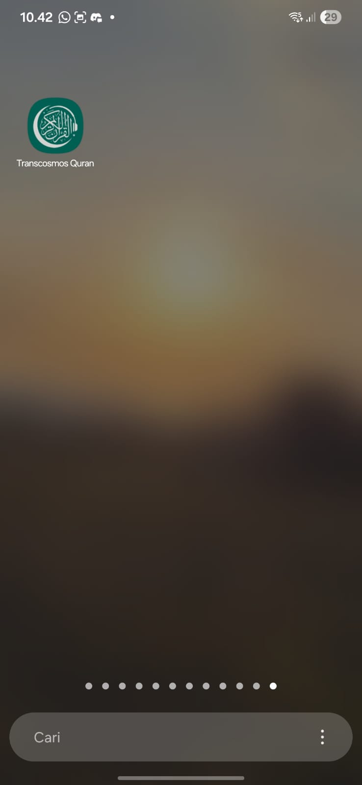

# 📖 Transcosmos Quran App

A beautifully crafted, premium **Al-Quran mobile application** built with Flutter. Browse all 114 Surahs, stream high-quality Murottal audio recitations, and navigate through Arabic text — all in a single elegant experience.

---

## ✨ Features

| Feature | Description |
|---|---|
| 📋 **Surah List** | Displays all 114 Surahs with Arabic name, English transliteration, number of verses, and revelation type (Makkiyah / Madaniyah) |
| 🔍 **Real-time Search** | Search across all 114 Surahs by English or Arabic name instantly — even before scrolling |
| 📄 **Infinite Scroll Pagination** | Client-side pagination loads 15 Surahs at a time for smooth scrolling performance |
| 🎵 **Audio Murottal Player** | Stream per-ayah audio from `alquran.cloud` assembled into a seamless playlist |
| ⏯️ **Full Playback Controls** | Play, Pause, Skip Next, Skip Previous, and interactive seek bar |
| ✨ **Lyric / Ayah Sync** | The displayed Arabic text dynamically updates and highlights exactly which Ayah is currently being recited |
| 📜 **Arabic Text Rendering** | Per-ayah Arabic text displayed with the Amiri font for authentic readability |
| 💫 **Shimmer Loading** | Skeleton shimmer animation during initial data fetch for a polished UX |
| 🚀 **Seamless Splash Screen** | Custom native Android/iOS splash screen that transitions seamlessly into an animated Flutter splash screen |
| 🛡️ **Custom Error Handling** | Global interceptors with user-friendly pop-up dialogs for connection timeouts and network errors |
| 🎨 **Adaptive App Icon** | Custom high-res Android adaptive icon and iOS launcher icon |
| 🔄 **Pull-to-Refresh** | Swipe down on the Surah list to reload data from the API |

---

## 🎥 Video Demo

<div align="center">
  <video src="https://raw.githubusercontent.com/ersandi15/Transcosmos-Quran/main/assets/video/video_app_transcosmos_quran.mp4" width="280" controls></video>
</div>

*Jika video tidak bisa diputar langsung, Anda bisa mendownload/melihatnya di folder [`assets/video/`](assets/video/)*

---

## 📸 Screenshots

*(Simpan hasil screenshot Anda di folder `assets/screenshots/` dengan nama file di bawah ini agar gambar otomatis muncul di GitHub)*

<div align="center">
  
  
  
  
  
  <br><br>
  
  
  
  
  
</div>

*Jika Anda ingin melihat gambar mentahnya, silakan buka folder [`assets/screenshots/`](assets/screenshots/)*

---

## 🏗️ Architecture

The project follows a clean **Feature-first** architecture combined with **GetX** for state management and routing, and a **Repository Pattern** for data access.

```
lib/
├── config/                     # Global design system & routing
│   ├── app_colours.dart        # Centralized color palette & gradients
│   ├── app_fonts.dart          # Typography system (Inter + Amiri)
│   ├── app_pages.dart          # Route-to-View bindings (GetX)
│   └── app_routes.dart         # Named route constants
│
├── services/
│   └── dio_service.dart        # Centralized HTTP client (Dio singleton)
│
├── features/
│   ├── splash_screen/          # Feature: Animated Splash
│   │   ├── controller/         # SplashScreenController
│   │   └── view/
│   │       └── ui/             # SplashScreenView
│   │
│   ├── surah/                  # Feature: Surah List
│   │   ├── controller/         # SurahController (GetxController)
│   │   ├── models/             # SurahResponseModel (JSON deserialization)
│   │   ├── repositories/       # ISurahRepository + SurahRepository
│   │   └── view/
│   │       ├── ui/             # SurahView (main screen)
│   │       └── components/     # SurahCard, SurahHeader, SurahLoadingSkeleton, SurahEmptyState
│   │
│   └── player/                 # Feature: Audio Player
│       ├── controller/         # PlayerController (GetxController)
│       ├── models/             # SurahDetailResponseModel
│       ├── repositories/       # IPlayerRepository + PlayerRepository
│       └── view/
│           ├── ui/             # PlayerView (player screen)
│           └── components/     # PlayerHeaderInfo, PlayerArabicText, PlayerControls
│
├── utils/                      # Shared utility functions
└── main.dart                   # App entry point
```

### Key Architectural Decisions

- **Repository Pattern**: All data access is abstracted behind interfaces (`ISurahRepository`, `IPlayerRepository`). This makes the code easily testable (mock repositories can be swapped in) and decoupled from the data source.
- **Client-Side Pagination**: The API (`/surah`) is called only **once** on app start, fetching all 114 Surahs. Pagination is then done in-memory, avoiding redundant network requests.
- **Dio Singleton**: `DioService` is implemented as a singleton to ensure a single shared HTTP client across all repositories, complete with timeout configuration and a logging interceptor.
- **Interface-based DI**: GetX lazy-puts concrete implementations bound to their interfaces, keeping controllers agnostic of the data source.

---

## 🛠️ Tech Stack

| Category | Package | Version | Purpose |
|---|---|---|---|
| **Framework** | Flutter | SDK | Cross-platform mobile app |
| **State Management & Routing** | `get` | ^4.7.3 | Reactive state, navigation, DI |
| **Networking** | `dio` | ^5.9.2 | HTTP client with interceptors |
| **Audio Playback** | `just_audio` | ^0.10.5 | Stable audio streaming & playlist |
| **Audio Session** | `audio_session` | ^0.2.3 | OS-level audio session management |
| **Progress Bar** | `audio_video_progress_bar` | ^2.0.3 | Seek bar UI widget |
| **Shimmer** | `shimmer` | ^3.0.0 | Skeleton loading animation |
| **Fonts** | `google_fonts` | ^8.0.2 | Inter (Latin) + Amiri (Arabic) |
| **SVG Icons** | `flutter_svg` | ^2.2.4 | Scalable vector icon rendering |

---

## 🎨 Design System

### Color Palette

The app uses a cohesive **Emerald Teal** color theme defined in `AppColours`:

| Token | Hex | Usage |
|---|---|---|
| `primary` | `#00695C` | Main brand color (dark teal) |
| `primaryLight` | `#26A69A` | Accents, progress indicators |
| `primaryDark` | `#003D33` | Deep tones, gradient end |
| `gradientStart` | `#4ADE80` | Bright green (icon gradients) |
| `gradientEnd` | `#059669` | Emerald green (icon gradients) |
| `backgroundLight` | `#F4F9F8` | Screen background |
| `textDark` | `#2D3748` | Primary text |

Three pre-built gradients are available: `primaryGradient`, `darkGradient` (used in player screen), and `accentGradient`.

### Typography

Defined in `AppFonts`, the app uses two Google Font families:

- **Inter** — Clean, modern Latin text for all UI labels, headings, and body copy
- **Amiri** — Classical Arabic typeface for rendering Quranic text with correct proportions

Available presets: `heading1`, `heading2`, `subtitle`, `body`, `arabicDisplay`, `arabicTitle`.

---

## 🌐 Data Source

All Quran data and audio is sourced from the free **AlQuran Cloud API**:

```
Base URL: https://api.alquran.cloud/v1
```

| Endpoint | Usage |
|---|---|
| `GET /surah` | Fetch all 114 Surahs (name, number, ayah count, revelation type) |
| `GET /surah/{number}/{edition}` | Fetch full Surah detail including per-ayah audio URLs |

---

## 🚀 Getting Started

### Prerequisites

- [Flutter SDK](https://docs.flutter.dev/get-started/install) `>= 3.10.8`
- [FVM (Flutter Version Manager)](https://fvm.app/) — optional but recommended (`.fvmrc` is included)
- Dart SDK `^3.10.8`

### Installation

1. **Clone the repository:**
   ```bash
   git clone <repository-url>
   cd transcosmos_test
   ```

2. **Install dependencies:**
   ```bash
   flutter pub get
   ```

3. **Run the app:**
   ```bash
   flutter run
   ```

### Using FVM (Recommended)

If you have FVM installed, the correct Flutter version is pinned in `.fvmrc`:

```bash
fvm use       # Install the pinned Flutter version
fvm flutter pub get
fvm flutter run
```

---

## 📱 App Flow

```
App Start
    │
    ▼
SplashScreenView (/splash)
    │  ─ Covers native engine startup via flutter_native_splash
    │  ─ Plays subtle fade-in scale animation
    │  ─ Navigates to Dashboard after 2.5 seconds
    │
    ▼
SurahView (/surah)
    │  ─ Fetches all 114 Surahs from API on init
    │  ─ Displays with shimmer skeleton during loading
    │  ─ Shows paginated list (15 items), loads more on scroll
    │  ─ Real-time search filters across all 114 Surahs
    │
    │  [Tap on a Surah Card]
    │
    ▼
PlayerView (/player)
    │  ─ Receives surah number via GetX arguments
    │  ─ Fetches full Surah detail (all Ayahs + audio URLs)
    │  ─ Assembles per-ayah audio into a continuous playlist
    │  ─ Streams Murottal audio with full playback controls
    │  ─ Displays Arabic text for all Ayahs
    │
    │  [Tap back arrow]
    │
    ▼
SurahView (/surah)
```

---

## 🧪 Running Tests

```bash
flutter test
```

### Unit Testing Architecture

To fulfill the bonus criteria, this project implements a **Unit Test** for the core logic layer (`SurahController`). 
We use **`mocktail`** to mock the `ISurahRepository`. This ensures that we test the search filtering, pagination limits, and loading states in isolation without making real HTTP requests.

Test files are located in the `test/` directory.

---

## 📦 Build

### Android APK
```bash
flutter build apk --release
```

### iOS (requires macOS + Xcode)
```bash
flutter build ios --release
```

---

## 🗂️ Project Information

| Field | Value |
|---|---|
| **App Name** | Transcosmos Quran |
| **Package Name** | `transcosmos_test` |
| **Version** | 1.0.0+1 |
| **Flutter SDK** | `^3.10.8` |
| **Dart SDK** | `^3.10.8` |
| **Target Platforms** | Android, iOS, Web, Linux, macOS, Windows |

---

## 🙏 Acknowledgements

- **[AlQuran Cloud](https://alquran.cloud/)** — Free, open Quran API providing surah data and audio recitations
- **[just_audio](https://pub.dev/packages/just_audio)** — Powerful Flutter audio plugin for seamless audio streaming
- **[GetX](https://pub.dev/packages/get)** — Lightweight state management and navigation framework
- **[Google Fonts](https://fonts.google.com/)** — Inter & Amiri typefaces for a premium reading experience

---

> Built with ❤️ using Flutter — *"Read, and your Lord is the most Generous"* (Al-Alaq: 3)
